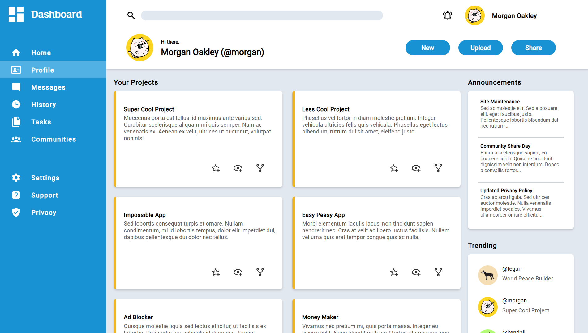

# Odin Admin Dashboard

An admin dashboard project built as part of [The Odin Project](https://www.theodinproject.com/)
Intermediate HTML and CSS section. This project demonstrates intermediate CSS and layout skills, focusing on creating a
visually structured dashboard interface.

## Project Overview

The Odin Admin Dashboard is designed to simulate a real-world admin interface, providing a clean layout for managing
content, users, or analytics. The project emphasizes **Grid layout**, while applying intermediate CSS techniques for
layout and styling.

## Features

### Dashboard Layout

-   Organized sections for navigation, main content, and widgets.
-   Grid used for arranging dashboard panels and cards.
-   Clear visual hierarchy for headers, menus, and content blocks.

### Components

-   Cards for displaying summarized information or metrics.
-   Buttons and input fields styled consistently.
-   Simulated sidebar navigation with active state indicators.

### Styling

-   Consistent color palette, typography, and spacing.
-   Hover and focus states for interactive elements.
-   Rudimentary responsive grid layouts to support different screen widths.

### Interactivity (CSS-Based)

-   Navigation hover states.
-   Form input focus and validation visual cues.
-   Basic layout responsiveness without JavaScript.

## Screenshots / Preview

### Dashboard Overview

### Content Section

## Learning Objectives

This project demonstrates:

-   **File Structure**: Organizing HTML and CSS for clarity, maintainability, and scalability.
-   **Layout Skills**: Using CSS Grid to structure a complex page.
-   **Component Design**: Creating reusable UI blocks like cards, navs, search bars and buttons.
-   **CSS Styling**: Applying advanced selectors, pseudo-classes, and consistent visual design.

## Live Demo

[View the Odin Admin Dashboard](https://jameslafontaine.github.io/odin-admin-dashboard/)

## Future Improvements

-   Adding interactivity with JavaScript (e.g., dynamic data, collapsible menus).
-   Fully responsive design with media queries for mobile and tablet screens.
-   Enhancing accessibility using ARIA attributes and keyboard navigation.
-   Implementing charts or dynamic widgets to simulate real admin functionality.
-   Polishing visual design with animations, transitions, and hover effects.
-   Implement **sticky positioning** for the header and sidebar to improve usability and user experience.

## License

This project is for educational purposes and follows The Odin Project’s curriculum guidelines.
